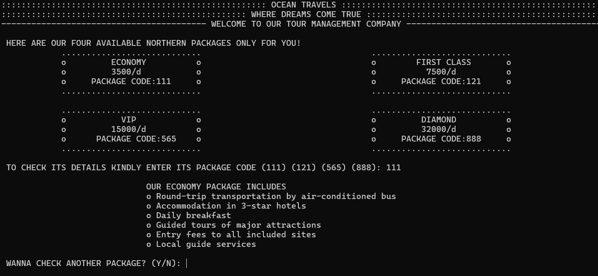

# 🌍 Traveling Management System (C++)

A simple console-based **Traveling Management System** built in C++.
Users can browse travel packages, book trips, manage passenger information, calculate total costs, and share feedback for an improved travel experience.

---

## ✨ Features

* **Package Details** – View available travel packages with destinations and prices
* **Booking System** – Reserve a package and enter passenger details
* **Cost Calculation** – Automatically calculates total cost based on package and passengers
* **Feedback System** – Users can leave feedback after booking
* **Menu Navigation** – Easy-to-use menu-driven interface

---

## 🛠️ Technologies Used

**Language:**
C++

**Libraries:**

* `<iostream>` – Input/output
* `<iomanip>` – Formatted display
* `<string>` – Handling text and feedback

---

## 🚀 How to Run

1. Clone the repository:

   ```bash
   git clone https://github.com/your-username/Traveling_Management_System.git
   cd Traveling_Management_System
   ```

2. Compile the program:

   ```bash
   g++ main.cpp -o Traveling_Management_System
   ```

3. Run the executable:

   ```bash
   ./Traveling_Management_System
   ```

---

## 📸 Sample Output

```
::::::::::::::::::::::::::::::::::::::::::::::::::::::: TRAVELING MANAGEMENT :::::::::::::::::::::::::::::::::::::::::::
.................................................. WELCOME TO OUR TRAVEL AGENCY .........................................

 SELECT AN OPTION:
 A) VIEW TRAVEL PACKAGES
 B) BOOK A PACKAGE
 C) CALCULATE TOTAL COST
 D) LEAVE FEEDBACK
 E) EXIT
```

---

## 🖼️ Screenshots / Preview



---

## 📚 Learning Outcomes

This project helps beginners practice:

* Arrays and strings in C++
* Function decomposition
* Menu-driven programming
* Input validation
* Cost calculation logic

---

## 👨‍💻 Author

Developed by **Bilal Asif**

---

